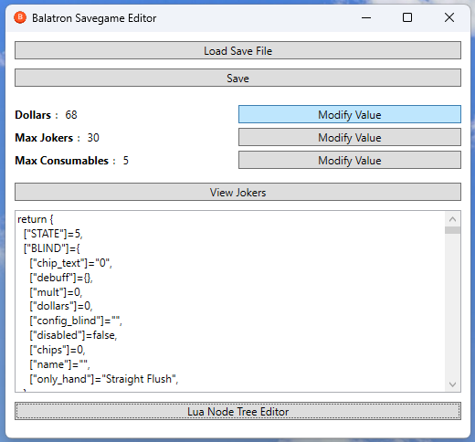
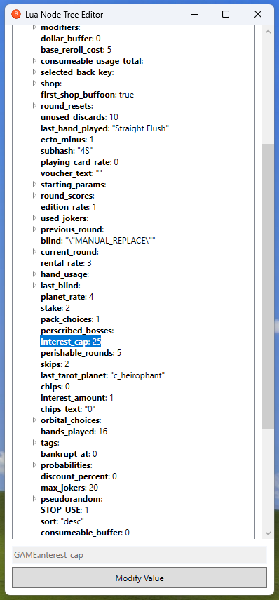
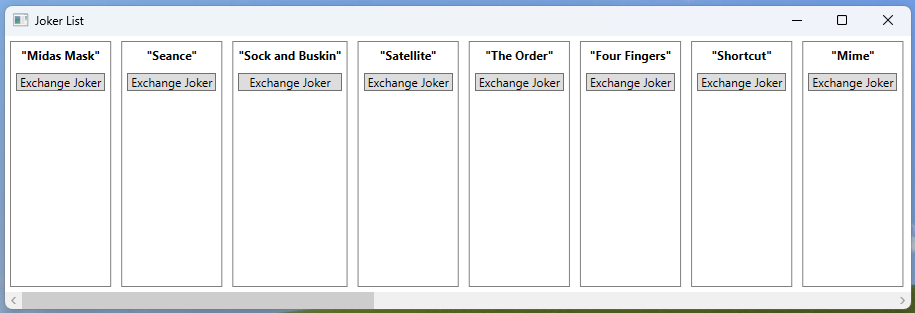

# Balatron

A WPF application for managing and editing Lua nodes and game state data.
For net6.0-windows

## Features

- **Lua Node Tree Editor**  
  View and modify structured Lua data.
- **Joker Management**  
  View and exchange joker cards.
- **Value Modification**  
  Edit values directly.

## Screenshots

### Lua Node Tree Editor

### Joker List

## Installation

1. Clone the repository.
2. Open the solution in JetBrains Rider or Visual Studio.
3. Build the solution.
4. Run the application.

## Usage

### Lua Node Tree Editor

- **Navigation:**  
  Explore nested Lua data by navigating through the tree.
- **Node Details:**  
  Double-click nodes to view detailed information.
- **Value Modification:**  
  Click the "Modify Value" button to edit node values.

### Joker List

- **Display:**  
  View all available jokers in a horizontal scrolling list.
- **Interaction:**  
  Use the provided buttons to exchange joker cards.
