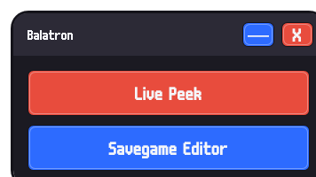
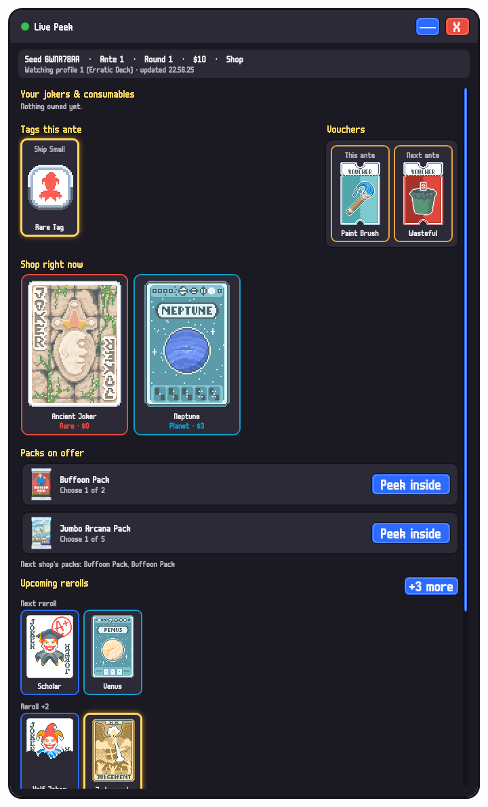
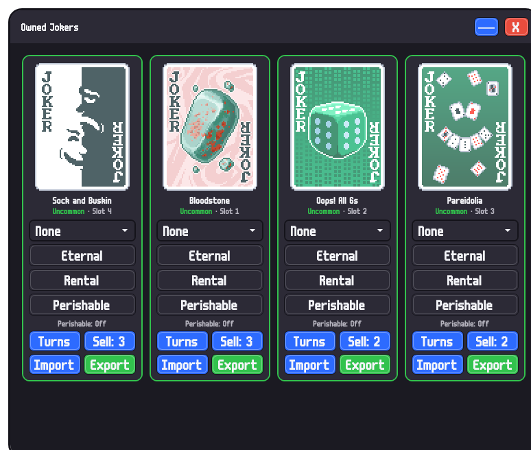
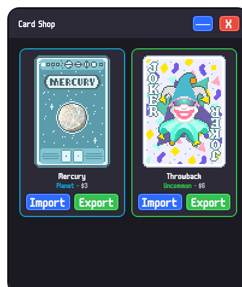
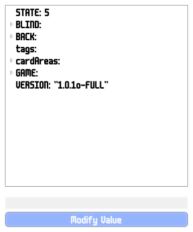

# Balatron

A Windows companion app for **Balatro** — see what the game is about to give you, and
edit your save when you'd rather just make it so.

[](https://github.com/lbinderup/Balatron/releases/latest)

Grab `Balatron.exe` from the [latest release](https://github.com/lbinderup/Balatron/releases/latest).
It needs the [.NET Desktop Runtime 6.0 or newer](https://dotnet.microsoft.com/download/dotnet/6.0/runtime)
(Windows x64) — .NET 8 or 9 works fine too.



---

## Live Peek

A floating, always-on-top window that watches your save and shows what the game has
lined up. Balatro autosaves after nearly every action, so it keeps pace with your run.



- **Your jokers & consumables** — everything you own. Cards with a predictable random
  effect are outlined in gold; hover one to see exactly what it would do *right now*:
  which joker Ectoplasm turns Negative, which one Ankh copies, which cards Familiar
  destroys and what you get back.
- **Tags this ante** — hover a tag for what it grants. Buffoon, Charm, Meteor, Standard
  and Ethereal tags show the full contents of the free pack they hand you.
- **Vouchers** — this ante's and next ante's, since the voucher only rerolls with the ante.
- **Shop right now** — current stock with editions, stickers and prices.
- **Packs on offer** — hover for the contents, or open the peek window to compare. Two
  packs of a kind draw from one shared card sequence, so they're shown together with the
  order-dependent result.
- **Upcoming rerolls** — the next several shop rerolls, before you spend a dollar.

Hover popups are layered: hover a tag to see its jokers, then hover one of *those* jokers
to read what it does.

### How the predictions work

Balatro's randomness is fully determined by the run seed plus a set of per-effect
counters, all of which live in the save file. Balatron reimplements the game's
`pseudohash` / `pseudoseed` and LuaJIT's `math.random` bit-for-bit, then replays the
same draws the game will make — no memory reading, no injection, no mods.

It accounts for the things that shift the odds: Showman, Telescope, Omen Globe, the
Tarot/Planet Merchant and Tycoon vouchers, Hone and Glow Up, deck-specific rates, stake
stickers, and which items are already used up.

Predictions are read-only. Balatron never writes to a save the game has open.

---

## Savegame Editor



- **Edit Owned Jokers** — change edition, toggle Eternal / Rental / Perishable, set
  perish turns and sell cost. Editions render with the game's own shaders, ported from
  Balatro's GLSL, so a Polychrome joker actually shimmers.
- **Edit Card Shop** — the shop's card slots, including tarots, planets, spectrals and
  playing cards, not just jokers.



- **Import / Export** — save any card to JSON and drop it into another slot or run.
- **Direct edits** — dollars, joker slots and consumable slots straight from the main
  editor window.
- **Lua Node Tree Editor** — the whole save as a tree, for anything the UI doesn't cover.



A timestamped backup is written next to your save every time you save.

---

## Building

Requires the .NET 6 SDK.

```bash
dotnet build Balatron/Balatron.csproj -c Release
```

To produce the distributable exe:

```bash
dotnet publish Balatron/Balatron.csproj -c Release -p:PublishProfile=FolderProfile
```

Pushing a `vX.Y.Z` tag builds that commit and publishes a GitHub Release automatically.

Working on this with an AI assistant? See [CLAUDE.md](CLAUDE.md) for the verification
protocol and the game-internals notes.

---

Balatron is an unofficial fan tool and is not affiliated with LocalThunk or Playstack.
